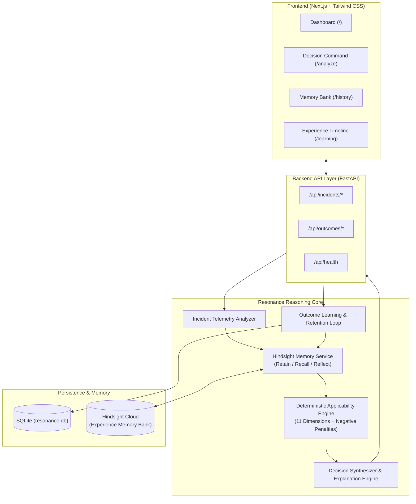

# RESONANCE 🚀
### Experience-Aware Incident Decision Intelligence

> **Resonance doesn't just find what worked before — it determines whether that experience is still safe to apply now.**
> **Core Innovation:** Separating **Semantic Similarity** from **Operational Applicability**.

---

## ⚡ The Core Problem

Autonomous SRE and troubleshooting agents search historical knowledge bases using semantic vector search (RAG). When an incident strikes, they find high similarity matches (e.g., 94% similarity) and blindly suggest executing the previous fix.

**However, what worked previously can be catastrophic today:**
- Database proxy layers (e.g., PostgreSQL 12 direct connections vs PostgreSQL 15 PgBouncer) may cause connection exhaustion or OOM kills.
- An unindexed database migration executed 30 minutes ago holds exclusive locks.
- Kubernetes runtime and resource scheduling controllers have evolved.

**Resonance fixes this by evaluating Applicability independently of Similarity.**

---

## 🏗️ System Architecture



---

## 📊 The 3 Demo Scenarios

### 1. 🔥 The Killer Demo: High Similarity (94%) ≠ High Applicability (38%)
- **Current Incident:** Payment API latency (8.4s) & 21% error rate on `POST /v1/charges` after database migration 34 mins ago.
- **Historical Precedent (INC-101):** 94% similarity. Historical fix was to increase pool size from 50 to 200.
- **Resonance Verdict:** **DO NOT REUSE** (Applicability: 38%, Risk: HIGH).
- **Why:** In PostgreSQL 15 with PgBouncer under an active schema migration lock, expanding the pool will cause cascading worker OOM crashes.
- **Recommended Action:** 🔄 Roll back deployment to v5.3.9 and cancel pending migration transaction.

### 2. 🟢 Demo 1: High Similarity (94%) = High Applicability (91%)
- **Current Incident:** Payment API latency under flash surge with identical runtime stack.
- **Resonance Verdict:** **SAFE TO REUSE** (Applicability: 91%, Risk: LOW).
- **Recommended Action:** Increase connection pool size to 200.

### 3. ⚡ Demo 3: Self-Learning Feedback Loop
- Capture human operator approvals, overrides, and post-resolution telemetry (MTTR, side effects).
- Instantly retains learned lessons back into Hindsight to adjust future precedent weighting.

---

## 🚀 Quickstart Guide

### 1. Backend Setup (FastAPI)
```bash
# In project root
pip install -r backend/requirements.txt

# Run backend test suite
pytest backend/tests/test_resonance.py -v

# Start FastAPI server
uvicorn backend.app.main:app --host 0.0.0.0 --port 8000 --reload
```

### 2. Frontend Setup (Next.js)
```bash
cd frontend
npm install
npm run dev
```
Open [http://localhost:3000](http://localhost:3000) to view the application.

---

## 🔑 Environment Variables (`.env`)

```env
# Hindsight Cloud Credentials (Optional - robust local fallback included)
HINDSIGHT_API_URL=https://api.hindsight.vectorize.io
HINDSIGHT_API_KEY=your_key_here
HINDSIGHT_BANK_ID=resonance-incidents

# LLM API Key (Optional)
GEMINI_API_KEY=your_key_here
```
